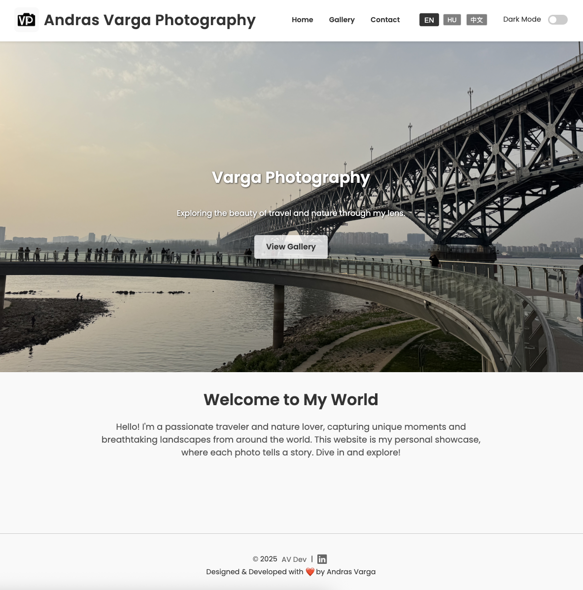
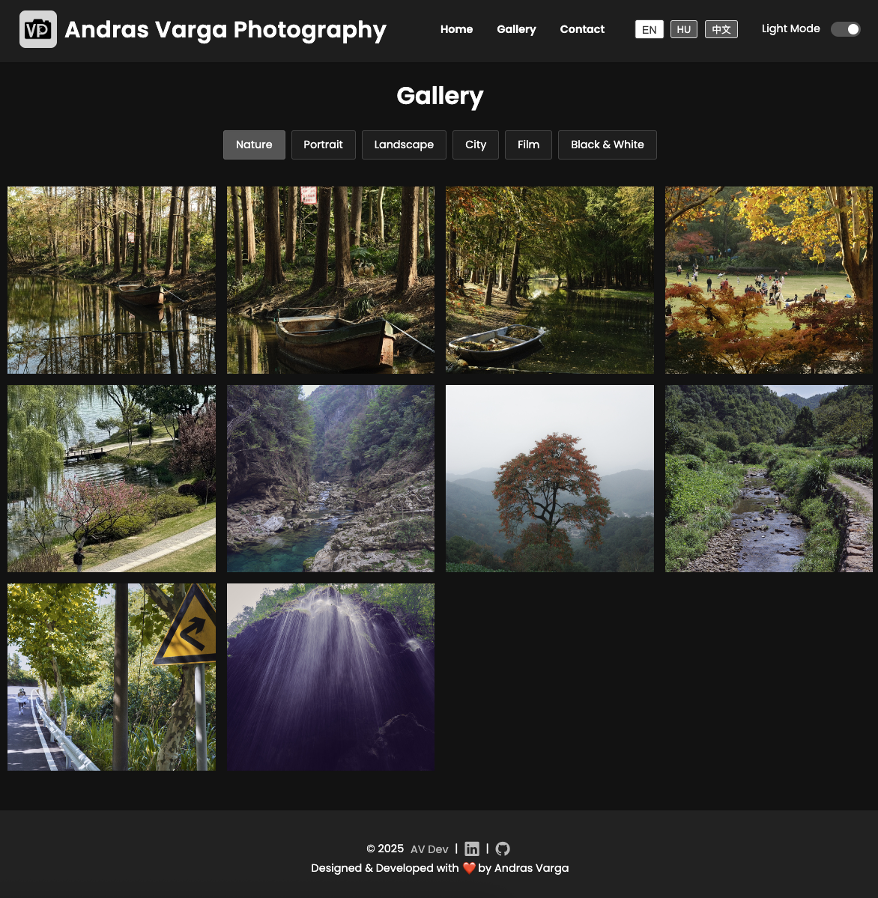

# Varga Photography Website

A modern, mobile-friendly photography portfolio website with advanced gallery features, multilingual support, and theme customization. Built with HTML, CSS, and JavaScript — optimized for GitHub Pages and static hosting.

## 🌍 Live Demo

https://andris811.github.io/vargaPhoto/

## ✨ Enhanced Features

### 🖼️ Advanced Gallery System
- **Smart Category Filtering**: Nature, Portrait, Landscape, City, Film, B&W
- **Numerical Sorting**: Proper 1-2-3 ordering (fixes 1-10-11 issue)
- **Dynamic Lightbox**: 
  - Full-screen viewing with keyboard navigation
  - Right-click protection on all images
  - Category-specific album grouping
- **Performance Optimized**:
  - Lazy-loaded images
  - Smooth transition animations
  - Automatic thumbnail generation

### 🌐 Localization

- Fully translated interface: English, Hungarian, Chinese
- Auto-detects browser language on first visit
- Stores user preference across sessions
- JSON-based translations for easy expansion
- Complete translation coverage:
  - Navigation menu
  - Gallery filters
  - Theme toggle labels
  - Contact form
  - Footer
  - Page titles


### 🌗 Theme Engine
- **Light/Dark Mode**:
  - System preference detection
  - Manual toggle with persistence
  - Automatic logo adjustment
- **Consistent Styling**:
  - Gallery controls
  - Navigation bar
  - Contact form
  - Footer

### 🛠️ Technical Upgrades
- **Automated Workflows**:
  - `npm run thumbs`: Force-regenerates all thumbnails
  - `npm run update`: Updates gallery data and assets
- **Improved Structure**:
  - Modular CSS (base, components, utilities)
  - Better organized JavaScript modules
- **Enhanced Security**:
  - Right-click protection on all gallery elements
  - Lightbox image protection

## 📁 Project Structure
```
varga-photography/
├── index.html             # Landing page with hero section
├── gallery.html           # Dynamic image gallery
├── contact.html           # Contact form
├── navbar.html            # Responsive navigation component
├── footer.html            # Footer component

├── /css
    └── styles.css         # All styles here

├── /js
│ ├── gallery.js           # Enhanced gallery with sorting
│ ├── gallery-data.js      # Auto-generated image data
│ ├── language.js          # Advanced translation system
│ ├── theme.js             # Theme management
│ ├── navbar.js            # Mobile menu handling
│ ├── footer.js            # Footer management
│ ├── main.js              # Back-to-top button for now

├── /lang
│ ├── en.json              # English translations
│ ├── hu.json              # Hungarian translations
│ └── zh.json              # Chinese translations

├── /assets
│ ├── logo.png             # Theme-aware logo
│ └── /images
│     ├── hero.jpg         # Optimized hero image
│     ├── /[category]      # Organized by category
│     │ ├── image1.jpg     # Full-size originals
│     │ └── /thumbs        # Auto-generated thumbnails
│     └── /screenshots     # Project documentation images

├── /scripts
│ ├── generate-thumbs.js   # Node script for thumbnail generation
│ └── generate-data.js     # Node script for creating gallery-data.js
```

## ⚙️ Setup & Deployment

### Development Setup
1. **Requirements**:
   - Node.js (v14+)
   - ImageMagick (for thumbnail generation)

2. **Installation**:
   ```bash
   git clone https://github.com/andris811/vargaPhoto.git
   cd vargaPhoto
   ```

3. **Adding Content**:
   - Place full-size images in `/assets/images/[category]/`
   - Run `npm run update` to process new images and update thumbnails

### Deployment Options
1. **GitHub Pages**:
   - Push to main branch
   - Enable GitHub Pages in repo settings
2. **Netlify/Vercel**:
   - Connect Git repository
   - Set build command: npm run update
   - Publish directory: /
3. **Manual Deployment**:
   - Run npm run update
   - Upload entire folder to any static host

## 🧰 Development Scripts
```bash
# Generate thumbnails (force rebuild)
npm run thumbs

# Update gallery data + thumbnails
npm run update

# Start local preview (if using live server)
npm start
```

## 🧱 Built With
- **HTML5 & CSS3**

- **SEO Optimized**: Proper meta tags and semantic HTML

- **Vanilla JavaScript**

- **[Lightbox2](https://lokeshdhakar.com/projects/lightbox2/)**

- **[Formspree](https://formspree.io/)**

## 📜 License
This project is open source and free to use for educational or personal purposes.

## 🖼️ Screenshots





## 🔖 Tags

Photography portfolio, responsive gallery, multilingual website, vanilla JavaScript, static site, lightbox, dark mode


##

### 🎨 Designed & Developed with ♥️ by **Andras Varga**